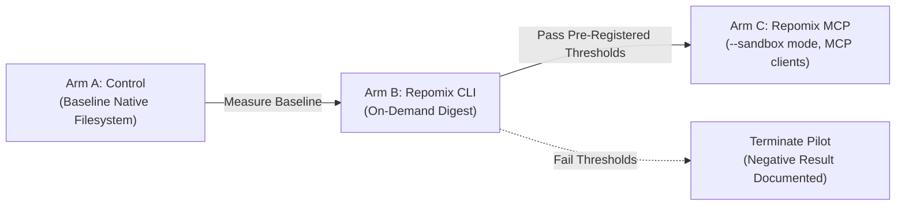

# H1 Repomix Pilot Design Specification

**Date**: 2026-09-19  
**Author**: Gemini (implementer)  
**Status**: Design - not a review artifact  
**Scope**: architecture, pilot-design, experimental-protocol, metrics  

---

## 1. Executive Summary

This document specifies the experimental design for the **H1 Repomix Pilot** evaluating the adoption of a universal repository digest layer across diverse AI coding assistants. In alignment with owner decisions M1-M5 and plan revision 2 section 6 (C1), this pilot establishes a rigorous, reproducible, multi-arm methodology comparing baseline unassisted file access against on-demand Repomix CLI digests and optional sandboxed Repomix MCP servers.

The pilot design includes 3 isolated experimental arms, a balanced 10-task test battery (5 broad kernel audits and 5 narrow surgical edits) with verbatim prompts, pre-registered adoption and termination thresholds, automated telemetry data collection via `.ai/runtime/metrics/sessions.jsonl`, and explicit confounder mitigation strategies.

---

## 2. Hypothesis and Projections

### 2.1 Core Scientific Hypothesis
A universal repository digest layer generated on-demand as a deterministic filesystem artifact reduces redundant file discovery, repeated whole-file reading, and overall token consumption across participating AI models without compromising implementation quality, audit depth, or protocol verification integrity.

### 2.2 Unverified Projections vs Empirical Status
Prior discussions and colleague exploratory reports suggested potential net token/cost reductions in the range of 35% to 65% (with peak claims reaching 75%). 
**Explicit Protocol Constraint**: These figures remain **unverified hypotheses and analytical forecasts**. They are not established facts and must never be recorded in `.ai/DECISIONS.md` or cited as validated performance metrics until empirically substantiated by the execution of this pilot protocol.

---

## 3. Experimental Arms

To isolate variables cleanly, the pilot implements three distinct arms. Transitions between arms are strictly conditional.



### 3.1 Arm A: Control (Baseline Native)
- **Tooling**: Standard repository toolchain. No Repomix CLI, no digests, no MCP servers.
- **Workflow**: Agents discover and inspect files using standard filesystem exploration (`list_dir`, `view_file`, `grep_search`, `run_command` git queries).
- **Context Injection**: Unmodified baseline SessionStart context injection (recent worklog, active tasks, decisions).

### 3.2 Arm B: Repomix CLI On-Demand (Universal Layer)
- **Tooling**: Pinned `repomix@1.18.0` CLI invoked on-demand via `npx -y repomix@1.18.0`.
- **Artifact Location**: Runtime-only disposable path: `.ai/runtime/kernel-digest.xml` (git-ignored, excluded from protocol digests).
- **Execution Modes**:
  - **Audits & Implementation**: Raw uncompressed digest (`--style xml --no-git-sort-by-changes`). Full fidelity preservation; zero loss of signatures or implementation details.
  - **High-level Orientation**: Compressed digest (`--compress --style xml`), utilizing tree-sitter signature extraction. Strictly prohibited for certifying audits.
- **Policy**: Never auto-injected into SessionStart; generated strictly when requested by an agent.

### 3.3 Arm C: Repomix CLI + Sandboxed MCP Server
- **Prerequisite**: Executed **only if Arm B meets all pre-registered thresholds** without quality regression.
- **Scope**: Restricted to MCP-capable clients (Claude Code, Codex CLI, IDE assistants). Web chat panels remain on Arm B CLI.
- **Configuration**:
  - Command: `npx -y repomix@1.18.0 --mcp --sandbox D:\Colabs`
  - Strict sandboxing: `--sandbox` confines operations to the repository root and disables remote package packing.
  - Pinned single-server deployment: Exactly one live MCP server.
- **Budget Enforced**: Tool-schema overhead must remain <= 1,500 tokens.

---

## 4. Task Battery (10 Crossed Tasks with Verbatim Prompts)

The task battery consists of 10 tasks divided evenly between broad architectural/kernel audits and narrow single-file surgical modifications. Each arm runs all 10 tasks in identical order.

### 4.1 Broad Tasks (Architectural & Security Audits)

#### Task 1: Audit of Liveness & Supervisor Process Tracking
- **Category**: Broad Audit (Architecture & OS Interop)
- **Files Involved**: `.ai/bin/protocol-session.cjs`, `.ai/bin/protocol-hooks.cjs`, `tests/session.test.cjs`
- **Verbatim Prompt**:
  ```text
  Audit the session liveness determination logic in .ai/bin/protocol-session.cjs (isSessionAlive) and .ai/bin/protocol-hooks.cjs. Evaluate: (1) supervisor PID inheritance vs transient process PID tracking across Windows (PowerShell/CMD) and POSIX shells; (2) zombie process and PID recycling vulnerabilities; (3) behavior when hostname mismatches occur (remote worktrees/containers). Identify edge cases where a live session could be mistakenly quarantined by prune, or where a dead session permanently blocks cleanup-runtime. Propose minimal hardening fixes.
  ```

#### Task 2: Cooperative Lock Concurrency & Recovery Audit
- **Category**: Broad Audit (Concurrency & Integrity)
- **Files Involved**: `.ai/bin/protocol-lock.cjs`, `tests/lock.test.cjs`, `AGENTS.md`
- **Verbatim Prompt**:
  ```text
  Perform an adversarial audit of the cooperative locking mechanism in .ai/bin/protocol-lock.cjs. Analyze: (1) race conditions during atomic lock acquisition; (2) recovery paths when an operation gate is abandoned due to SIGINT or abrupt termination; (3) stale lock resolution rules (heldForMinutes heuristic vs process liveness verification); (4) multi-agent collision handling when two CLI sessions acquire simultaneously. Render a verdict with concrete reproduction steps for any race condition discovered.
  ```

#### Task 3: Handoff Verification & Cryptographic Digest Chain Audit
- **Category**: Broad Audit (Cryptographic Integrity & Security)
- **Files Involved**: `.ai/bin/protocol-handoff.cjs`, `tests/handoff.test.cjs`, `tests/handoff-chain.test.cjs`
- **Verbatim Prompt**:
  ```text
  Audit the handoff certification and verification chain in .ai/bin/protocol-handoff.cjs. Evaluate: (1) transition and backward compatibility between entry format 1 and authenticated entry format 2; (2) canonical entry body normalization and resilience against whitespace/BOM manipulation; (3) git tree SHA computation fidelity across platforms; (4) effectiveness and leak risks of secret pattern redaction during record and rehash. Verify that an entry cannot be modified after certification without breaking verify --deep.
  ```

#### Task 4: Worklog Retention, Rotation & Compaction Audit
- **Category**: Broad Audit (Lifecycle & State Management)
- **Files Involved**: `.ai/bin/protocol-archive.cjs`, `.ai/bin/protocol-hooks.cjs`, `tests/archive.test.cjs`
- **Verbatim Prompt**:
  ```text
  Audit the journal lifecycle, 150-line limit enforcement, and automatic archiving in .ai/bin/protocol-archive.cjs and .ai/bin/protocol-hooks.cjs. Analyze: (1) auto-archive invocation triggers during stop and record; (2) atomic transfer of oldest entries into .ai/ARCHIVE.md without data corruption; (3) preservation of the latest entry baseline across SessionStart compact and resume events; (4) multi-session journal count limits (30-file cap). Determine if any scenario allows silent loss of historical journal entries.
  ```

#### Task 5: Cross-Assistant Hook Parity & Isolation Audit
- **Category**: Broad Audit (Tooling Parity & Platform Integration)
- **Files Involved**: `.claude/hooks/protocol-hooks.cjs`, `.codex/hooks/protocol.cjs`, `.ai/bin/protocol-session.cjs`, `CLAUDE.md`, `.ai/docs/CODEX.md`
- **Verbatim Prompt**:
  ```text
  Audit cross-assistant protocol hook execution parity between Claude Code, Codex CLI, and non-hook CLI assistants (Qwen, DeepSeek, GLM, Mistral). Verify: (1) session identity isolation and nonce generation across independent assistants running in the same checkout; (2) worktree awareness and project root resolution when commands are executed from subdirectories; (3) behavior under identity-less CI environments; (4) consistency of Stop telemetry across all execution vectors.
  ```

---

### 4.2 Narrow Tasks (Surgical Single-File Modifications)

#### Task 6: Add Exported Lock Acquisition Timeout Constant
- **Category**: Narrow Edit (Single-file Refactoring)
- **Target File**: `.ai/bin/protocol-lock.cjs`
- **Test File**: `tests/lock.test.cjs`
- **Verbatim Prompt**:
  ```text
  In .ai/bin/protocol-lock.cjs, declare and export a named constant LOCK_ACQUIRE_TIMEOUT_MS = 5000 representing the default lock acquisition timeout. Add a unit test in tests/lock.test.cjs verifying that the constant is exported, is an integer, and equals 5000. Run the test to ensure it passes. Do not modify any other file or change lock acquisition logic.
  ```

#### Task 7: Extract and Export Entry Counting Helper
- **Category**: Narrow Edit (Single-file Refactoring)
- **Target File**: `.ai/bin/protocol-archive.cjs`
- **Test File**: `tests/archive.test.cjs`
- **Verbatim Prompt**:
  ```text
  In .ai/bin/protocol-archive.cjs, extract the worklog entry counting logic into a reusable function countWorklogEntries(text). The function should count headings matching /^## \d{4}-\d{2}-\d{2}/m and return a non-negative integer. Export this function. Add a unit test in tests/archive.test.cjs verifying its behavior with 0, 1, and 3 entries. Ensure existing tests remain green.
  ```

#### Task 8: Add Telemetry Boundary Non-Negativity Guard
- **Category**: Narrow Edit (Safety Guard)
- **Target File**: `.ai/bin/protocol-hooks.cjs`
- **Test File**: `tests/hooks.test.cjs`
- **Verbatim Prompt**:
  ```text
  In .ai/bin/protocol-hooks.cjs, inspect the computation of durationSec in run('Stop'). Add an explicit defensive guard ensuring that if system clock drift or NTP adjustments produce a negative elapsed time, durationSec evaluates to 0. Add a unit test in tests/hooks.test.cjs simulating a future startTime and verifying durationSec === 0. Keep all existing hook tests green.
  ```

#### Task 9: Extend CLI whoami Output with Hostname
- **Category**: Narrow Edit (CLI Observability)
- **Target File**: `.ai/bin/protocol-session.cjs`
- **Test File**: `tests/session.test.cjs`
- **Verbatim Prompt**:
  ```text
  In .ai/bin/protocol-session.cjs, update the whoami command handler to include the current machine hostname in the printed JSON object under the key 'hostname' (using os.hostname()). Update tests/session.test.cjs to assert that whoami output includes 'hostname' matching os.hostname(). Ensure all other whoami fields remain intact.
  ```

#### Task 10: Enforce Trailing Slash Normalization in Manifest Fixture Helper
- **Category**: Narrow Edit (Test Infrastructure)
- **Target File**: `tests/helpers.cjs`
- **Test File**: `tests/manifest.test.cjs`
- **Verbatim Prompt**:
  ```text
  In tests/helpers.cjs, update seedProtocol() so that when reading paths from protocol-manifest.json, any path string is normalized to strip accidental trailing forward slashes or backslashes before checking existence. Add a unit test in tests/manifest.test.cjs verifying that trailing slash paths in manifest mocks are safely normalized.
  ```

---

## 5. Metrics and Evaluation Framework

### 5.1 Primary Metric
- **Total Session Tokens ($T_{\text{total}}$)**:
  - Total tokens consumed across all turns for the task (prompt input + completion output).
  - Measurement source: Orchestrator-reported token usage where available in session metadata.
  - Fallback estimate (pre-registered): $\lceil \text{Total Request/Response Bytes} / 4 \rceil$.

### 5.2 Secondary Metrics
- **Tool Schema Overhead ($T_{\text{schema}}$)**: Fixed token consumption incurred per turn by registered tool schemas (measured via tokenizer on tool definitions).
- **Files Read Count ($N_{\text{files}}$)**: Number of unique filesystem read operations executed by the assistant.
- **Time to First Edit ($t_{\text{first\_edit}}$)**: Telemetry field `firstEditMs` recorded in `.ai/runtime/metrics/sessions.jsonl`.
- **Session Wall Time ($t_{\text{wall}}$)**: Telemetry field `durationSec` recorded in `.ai/runtime/metrics/sessions.jsonl`.
- **Handoff Completeness Rate ($R_{\text{handoff}}$)**: Percentage of sessions achieving `handoffComplete: true` on initial stop without requiring user intervention.
- **Quality Verification Rubric (Binary Pass/Fail)**:
  - 100% test pass rate (`test-protocol.ps1` exit code 0).
  - 0 validator warnings (`validate-protocol.ps1` exit code 0).
  - Zero out-of-scope file modifications (`git diff --stat`).

---

## 6. Pre-Registered Adoption and Termination Thresholds

In compliance with empirical protocol standards, thresholds are pre-registered prior to pilot execution. Arm B (CLI) must satisfy all gates before considering Arm C (MCP).

| Metric | Target / Gate | Requirement | Action on Breach |
|---|---|---|---|
| **Broad Task Token Reduction** | $\Delta T_{\text{broad}} \ge 25\%$ | Median total token reduction on broad tasks in Arm B vs Arm A must be at least 25%. | **FAIL**: Reject universal digest layer; cancel MCP pilot. |
| **Narrow Task Regression Ceiling** | $\Delta T_{\text{narrow}} \le +5\%$ | Median token consumption on narrow tasks must not increase by more than 5%. | **FAIL**: Digest overhead exceeds value on focused edits; cancel adoption. |
| **Tool Schema Budget (Arm C)** | $T_{\text{schema}} \le 1,500$ | Tool schema overhead in Arm C must remain under 1,500 tokens. | **FAIL**: Schema tax excessive; reject Repomix MCP. |
| **Handoff Completeness** | $R(\text{handoff}) \ge R(\text{Arm A})$ | Handoff completeness rate must not decrease relative to Arm A baseline on the same task set (a strict 100% is not required where the Arm A baseline is below it). | **FAIL**: Digest causes context confusion or incomplete handoffs; reject. |
| **Verification Gate** | Pass Rate = 100% | All test suites and protocol validators must pass with 0 errors. | **FAIL**: Immediate halt on regression. |

### Termination Rule
If Arm B fails any pre-registered threshold, the pilot terminates immediately. A negative result report (`docs/reviews/2026-09-19-h1-pilot-report.md`) is authored, documenting empirical metrics. No MCP servers will be installed or evaluated.

---

## 7. Execution Procedure

1. **Baseline Freeze**:
   - Freeze the repository state at the commit that includes this C1 instrumentation (created after the audit).
   - Ensure working tree is clean.
2. **Environment Pinning**:
   - OS: Windows 11 x64.
   - Node.js: v22.21.0.
   - Model Identifiers: Fixed snapshots (e.g. `claude-3-5-sonnet-20241022`, `deepseek-chat`, `gemini-2.5-pro`). No floating or auto-updating `latest` tags.
3. **Repetition and Replication**:
   - Run 3 full repetitions per task per arm ($10 \text{ tasks} \times 3 \text{ reps} \times 3 \text{ arms} = 90 \text{ sessions}$).
   - Clear session caches and temporary files between trials.
4. **Data Collection**:
   - Automated ingestion of JSONL records from `.ai/runtime/metrics/sessions.jsonl`.
   - Log exact token counts reported by client harnesses.
5. **No Protocol Mutations**:
   - Protocol specifications, core scripts, and test suites must remain identical across all arms.
6. **Reporting**:
   - Execution findings, statistical distributions, median deltas, and final disposition must be compiled into `docs/reviews/2026-09-19-h1-pilot-report.md`.

---

## 8. Confounders and Mitigation Strategies

1. **Model Version Drift**:
   - *Risk*: Upstream provider model updates alter token efficiency or code comprehension mid-pilot.
   - *Mitigation*: Pin immutable model version strings; log exact model parameters and temperature settings.
2. **Prompt Cache Warmth**:
   - *Risk*: Provider prompt-caching mechanisms skew wall time and billed input token measurements across sequential runs.
   - *Mitigation*: Record cache-hit and cache-miss token metrics separately; enforce inter-trial cooling periods if necessary.
3. **Learning / Ordering Effects**:
   - *Risk*: Agent trajectory influenced by residual state or deterministic execution order bias.
   - *Mitigation*: Reset Git tree to clean baseline snapshot before each trial; pseudo-randomize task presentation order per arm.
4. **System Load Fluctuation**:
   - *Risk*: Background OS processes distort `durationSec` and `firstEditMs`.
   - *Mitigation*: Execute pilot runs during controlled idle periods; rely on median and interquartile range (IQR) rather than mean.

---

## 9. Non-Goals and Explicit Exclusions

The following capabilities and components are explicitly excluded from the H1 pilot:
- **Serena LSP Server**: Deferred to future pilot (P2) pending H1 results.
- **Qdrant Semantic Search**: Deferred to future pilot (P3) for review prose indexing.
- **AST / Graph Chunking (CodeGraphContext, Graphiti)**: Rejected for v1.9.5 due to Windows runtime incompatibilities (FalkorDB Unix limitation) and PowerShell omissions.
- **Multi-Model Cooperation Matrix**: Out of scope for H1; addressed in post-pilot architectural phases.
- **Automated Digest Context Injection**: The digest shall never be automatically prepended to `SessionStart` context; it remains an on-demand resource only.
